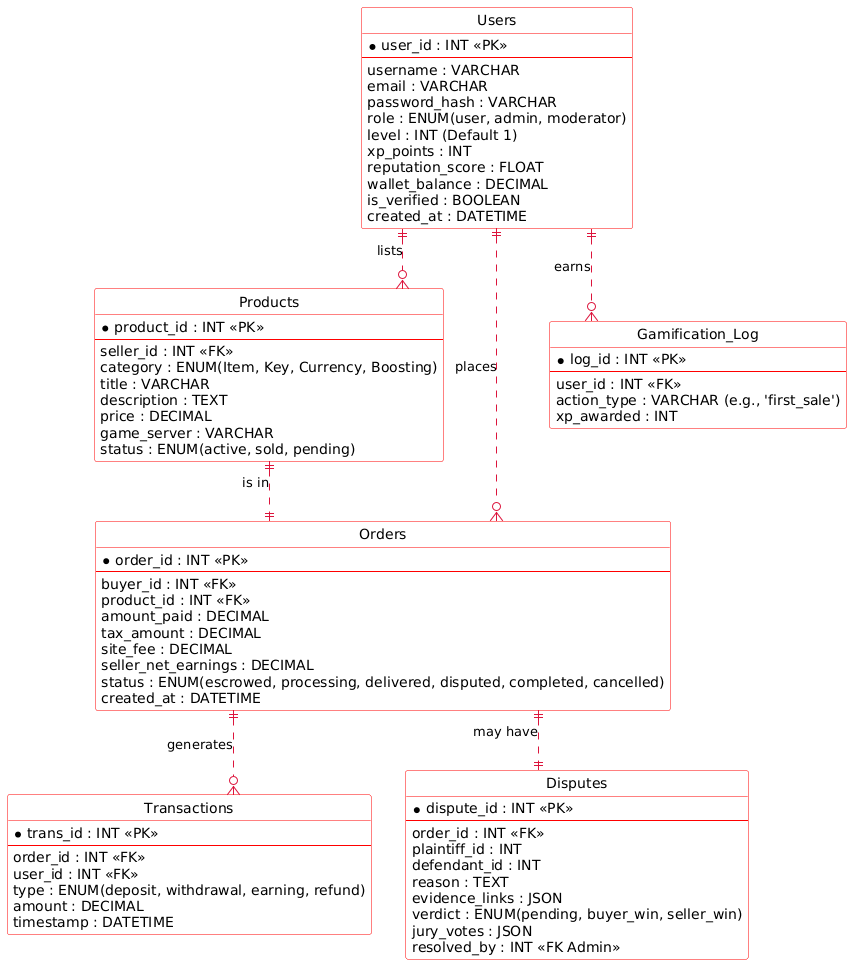
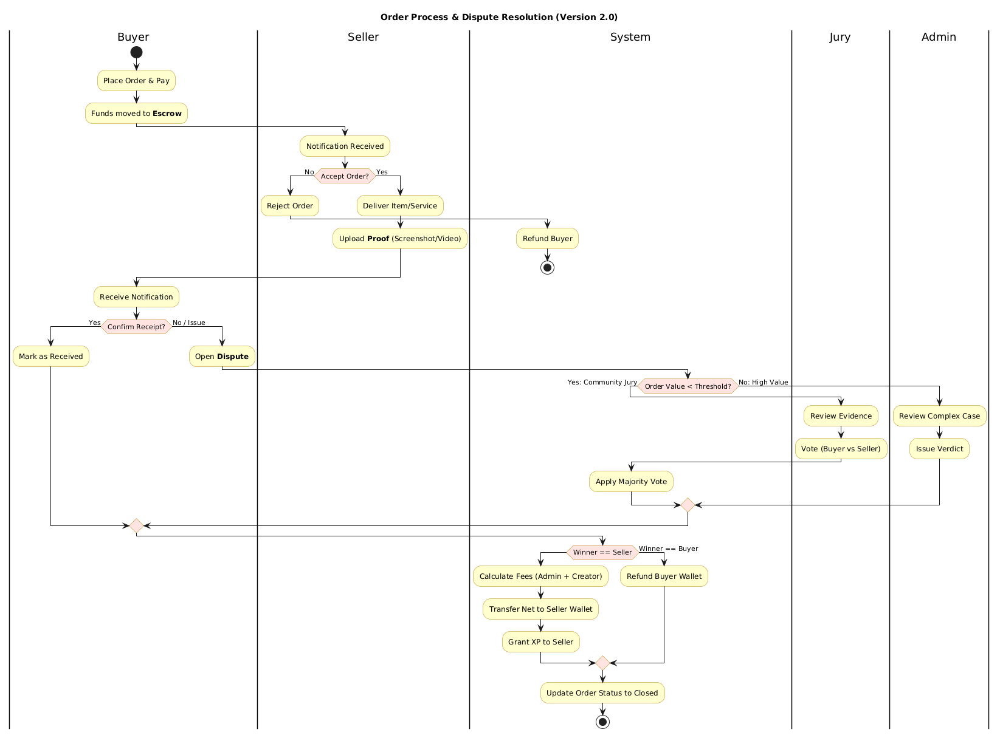
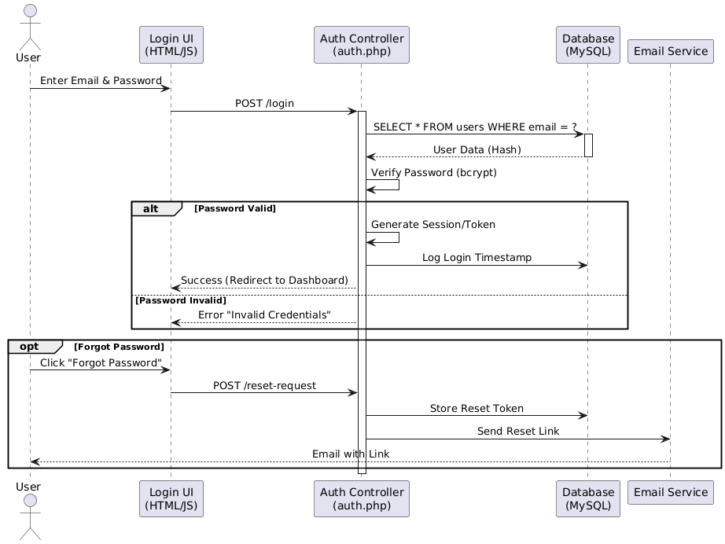

1-

@startuml
skinparam actorStyle awesome
skinparam packageStyle rectangle
skinparam usecase {
    BackgroundColor DarkSeaGreen
    BorderColor DarkSlateGray
    ArrowColor OliveDrab
}

actor "Guest/Visitor" as Guest
actor "User (Buyer)" as Buyer
actor "User (Seller)" as Seller
actor "Admin/Moderator" as Admin
actor "Community Jury" as Jury

package "Digital Trust Ecosystem" {
    
    package "Public Access" {
        usecase "Register/Login" as UC1
        usecase "View Ads (Popup/Slider)" as UC2
        usecase "Search Products" as UC3
    }

    package "Trading System" {
        usecase "Create Order (Escrow)" as UC4
        usecase "Deliver Item/Service" as UC5
        usecase "Upload Proof (Screenshot/Video)" as UC6
        usecase "Confirm Delivery" as UC7
        usecase "Rate & Review" as UC8
    }

    package "Dispute & Moderation" {
        usecase "Open Dispute" as UC9
        usecase "Vote on Dispute (Jury)" as UC10
        usecase "Final Judgement" as UC11
        usecase "Freeze/Ban User" as UC12
    }

    package "Gamification & Wallet" {
        usecase "Level Up" as UC13
        usecase "Withdraw Funds" as UC14
        usecase "Apply Coupon" as UC15
    }
}

Guest --> UC1
Guest --> UC2
Guest --> UC3

Buyer --> UC4
Buyer --> UC7
Buyer --> UC8
Buyer --> UC9
Buyer --> UC13

Seller --> UC5
Seller --> UC6
Seller --> UC14

Admin --> UC11
Admin --> UC12
Admin --> UC2 : Manage Ads

Jury --> UC10

UC9 ..> UC10 : <<include>>
UC9 ..> UC11 : <<include>>
UC4 ..> UC15 : <<extend>>

@enduml

2-

@startuml
' hide the spot
hide circle

' avoid problems with angled crows feet
skinparam linetype ortho

skinparam class {
    BackgroundColor White
    ArrowColor Crimson
    BorderColor Red
}

entity "Users" as users {
    *user_id : INT <<PK>>
    --
    username : VARCHAR
    email : VARCHAR
    password_hash : VARCHAR
    role : ENUM(user, admin, moderator)
    level : INT (Default 1)
    xp_points : INT
    reputation_score : FLOAT
    wallet_balance : DECIMAL
    is_verified : BOOLEAN
    created_at : DATETIME
}

entity "Products" as products {
    *product_id : INT <<PK>>
    --
    seller_id : INT <<FK>>
    category : ENUM(Item, Key, Currency, Boosting)
    title : VARCHAR
    description : TEXT
    price : DECIMAL
    game_server : VARCHAR
    status : ENUM(active, sold, pending)
}

entity "Orders" as orders {
    *order_id : INT <<PK>>
    --
    buyer_id : INT <<FK>>
    product_id : INT <<FK>>
    amount_paid : DECIMAL
    tax_amount : DECIMAL
    site_fee : DECIMAL
    seller_net_earnings : DECIMAL
    status : ENUM(escrowed, processing, delivered, disputed, completed, cancelled)
    created_at : DATETIME
}

entity "Transactions" as trans {
    *trans_id : INT <<PK>>
    --
    order_id : INT <<FK>>
    user_id : INT <<FK>>
    type : ENUM(deposit, withdrawal, earning, refund)
    amount : DECIMAL
    timestamp : DATETIME
}

entity "Disputes" as disputes {
    *dispute_id : INT <<PK>>
    --
    order_id : INT <<FK>>
    plaintiff_id : INT
    defendant_id : INT
    reason : TEXT
    evidence_links : JSON
    verdict : ENUM(pending, buyer_win, seller_win)
    jury_votes : JSON
    resolved_by : INT <<FK Admin>>
}

entity "Gamification_Log" as gamification {
    *log_id : INT <<PK>>
    --
    user_id : INT <<FK>>
    action_type : VARCHAR (e.g., 'first_sale')
    xp_awarded : INT
}

users ||..o{ products : "lists"
users ||..o{ orders : "places"
products ||..|| orders : "is in"
orders ||..o{ trans : "generates"
orders ||..|| disputes : "may have"
users ||..o{ gamification : "earns"

@enduml

3-

@startuml
skinparam ActivityBackgroundColor #FEFECE
skinparam ActivityBorderColor #B8860B
skinparam ActivityDiamondBackgroundColor #FFE4E1

title Order Process & Dispute Resolution (Version 2.0)

|Buyer|
start
:Place Order & Pay;
:Funds moved to **Escrow**;

|Seller|
:Notification Received;
if (Accept Order?) then (No)
  :Reject Order;
  |System|
  :Refund Buyer;
  stop
else (Yes)
  |Seller|
  :Deliver Item/Service;
  :Upload **Proof** (Screenshot/Video);
endif

|Buyer|
:Receive Notification;
if (Confirm Receipt?) then (Yes)
  :Mark as Received;
else (No / Issue)
  :Open **Dispute**;
  |System|
  if (Order Value < Threshold?) then (Yes: Community Jury)
    |Jury|
    :Review Evidence;
    :Vote (Buyer vs Seller);
    |System|
    :Apply Majority Vote;
  else (No: High Value)
    |Admin|
    :Review Complex Case;
    :Issue Verdict;
  endif
endif

|System|
if (Winner == Seller) then
  :Calculate Fees (Admin + Creator);
  :Transfer Net to Seller Wallet;
  :Grant XP to Seller;
else (Winner == Buyer)
  :Refund Buyer Wallet;
endif

:Update Order Status to Closed;
stop

@enduml

4-

@startuml
skinparam sequenceMessageAlign center
skinparam responseMessageBelowArrow true

actor User
participant "Login UI\n(HTML/JS)" as UI
participant "Auth Controller\n(auth.php)" as Auth
participant "Database\n(MySQL)" as DB
participant "Email Service" as Mail

User -> UI : Enter Email & Password
UI -> Auth : POST /login
activate Auth

Auth -> DB : SELECT * FROM users WHERE email = ?
activate DB
DB --> Auth : User Data (Hash)
deactivate DB

Auth -> Auth : Verify Password (bcrypt)

alt Password Valid
    Auth -> Auth : Generate Session/Token
    Auth -> DB : Log Login Timestamp
    Auth --> UI : Success (Redirect to Dashboard)
else Password Invalid
    Auth --> UI : Error "Invalid Credentials"
end

opt Forgot Password
    User -> UI : Click "Forgot Password"
    UI -> Auth : POST /reset-request
    Auth -> DB : Store Reset Token
    Auth -> Mail : Send Reset Link
    Mail --> User : Email with Link
end

deactivate Auth
@enduml

5-

@startuml
skinparam state {
  BackgroundColor Cyan
  BorderColor Blue
}

[*] --> Created : Buyer Pays

state Created {
    User -> Escrow : Money Locked
}

Created --> Cancelled : Seller Rejects
Created --> Processing : Seller Accepts

state Processing {
   Seller --> Boosting : Service Ongoing
   Seller --> Item : Preparing Transfer
}

Processing --> ProofUploaded : Seller Submits Proof
Processing --> Disputed : Buyer Reports Issue Early

state ProofUploaded {
    User -> Review : Buyer Checks Item
}

ProofUploaded --> Completed : Buyer Confirms
ProofUploaded --> Disputed : Buyer Rejects

state Disputed {
    Jury --> Verdict : Voting
    Admin --> Verdict : Final Check
}

Disputed --> Completed : Verdict: Seller Wins
Disputed --> Refunded : Verdict: Buyer Wins

Completed --> [*] : Release Funds
Refunded --> [*] : Return Funds
Cancelled --> [*]

@enduml

6-

@startuml
skinparam componentStyle uml2

package "Frontend (Client Side)" {
    [index.php] as Index
    [dashboard.php] as Dash
    [assets/js/app.js] as JS
    [assets/css/style.css] as CSS
}

package "Backend Logic (PHP)" {
    component "Controllers" {
        [AuthController]
        [OrderController]
        [DisputeController]
    }
    
    component "Models" {
        [User.php]
        [Product.php]
        [Transaction.php]
    }
    
    component "Helpers" {
        [Database.php (PDO)]
        [Security.php]
        [UploadHandler.php]
    }
}

database "MySQL Database" as MySQL

Index ..> AuthController : Forms
Dash ..> OrderController : Actions
Dash ..> DisputeController : Reports

AuthController --> User.php
OrderController --> Product.php
OrderController --> Transaction.php

User.php --> Database.php
Product.php --> Database.php

Database.php --> MySQL : SQL Queries

@enduml

7-

@startuml
skinparam rectangle {
    BackgroundColor #F5F5F5
    BorderColor #333333
    RoundCorner 10
}
skinparam arrowColor #FF5722

title نقشه سایت و جریان ناوبری (Sitemap)

rectangle "Home Page (Landing)" as Home

package "Auth Pages" {
    rectangle "Login" as Login
    rectangle "Register" as Reg
    rectangle "Forgot Password" as Forgot
}

package "Marketplace" {
    rectangle "Search / Browse" as Shop
    rectangle "Product Details" as Product
    rectangle "Checkout / Payment" as Checkout
}

package "User Dashboard" {
    rectangle "Overview" as U_Dash
    rectangle "My Orders" as U_Orders
    rectangle "Wallet / Deposit" as U_Wallet
    rectangle "Create Listing" as U_Sell
    rectangle "Dispute Center" as U_Dispute
}

package "Admin Panel" {
    rectangle "Admin Dashboard" as A_Dash
    rectangle "User Management" as A_Users
    rectangle "Transactions" as A_Trans
    rectangle "Dispute Resolution (Judge)" as A_Judge
}

Home --> Login
Home --> Reg
Home --> Shop

Login --> Forgot
Login --> U_Dash : If User
Login --> A_Dash : If Admin

Shop --> Product
Product --> Checkout
Checkout --> U_Orders : After Payment

U_Dash --> U_Orders
U_Dash --> U_Wallet
U_Dash --> U_Sell
U_Dash --> U_Dispute

A_Dash --> A_Users
A_Dash --> A_Trans
A_Dash --> A_Judge

@enduml

8-

@startuml
skinparam handwritten false
skinparam monochrome false
skinparam packageStyle rectangle
skinparam linetype ortho

title Digital Trust Ecosystem - Site Map & Navigation

package "Public Area" {
    [Home Page (index.php)] as Home
    [Login / Register] as Auth
    [Marketplace (Listings)] as Market
    [Product Details] as Product
}

package "User Dashboard (Protected)" {
    [Dashboard Home] as Dash
    [My Wallet (Deposit/Withdraw)] as Wallet
    [My Orders (Buyer)] as MyOrders
    [My Sales (Seller)] as MySales
    [Settings & Verification] as Settings
    [Order Chat & Proof Upload] as OrderPage
}

package "Admin & Jury Panel" {
    [Admin Dashboard] as AdminDash
    [Dispute Center (Jury/Admin)] as Disputes
    [User Management] as UserMan
    [Financial Logs] as Logs
}

Home --> Auth : Guest
Home --> Market : Browse
Market --> Product : Click Item

Auth --> Dash : Success Login

Dash --> Wallet
Dash --> MyOrders
Dash --> MySales
Dash --> Settings

MyOrders --> OrderPage : View Status
MySales --> OrderPage : Deliver/Upload Proof

OrderPage --> Disputes : Open Dispute

AdminDash --> Disputes : Final Verdict
AdminDash --> UserMan : Ban/Verify
AdminDash --> Logs : Review

@enduml

9-

@startuml
skinparam ActivityBackgroundColor #E0FFFF
skinparam ActivityBorderColor #008080
skinparam ActivityDiamondBackgroundColor #FFD700

title AI-Assisted Development Workflow (GitHub + AI Studio)

start
:Define Today's Task;
note right
Example: "Create Login Page"
or "Build Escrow Logic"
end note

:Select Relevant Diagrams;
note right
Always include: **ER Diagram (Database)**
+ The specific diagram for the task
(e.g., Sequence for Login)
end note

:Prompt AI Studio;
note right
"Act as a Senior PHP Developer.
Here is the DB Schema and the Logic Diagram.
Write the code for [Task Name]."
end note

:AI Generates Code;

if (Is Database Needed?) then (Yes)
    :Execute SQL in MySQL (phpMyAdmin);
endif

:Create/Update PHP Files;
:Run & Test on Localhost;

if (Error or Bug?) then (Yes)
    :Copy Error Message;
    :Feed back to AI Studio;
    note right
    "I got this error: [Error].
    Fix the code."
    end note
    stop
else (No / It Works)
    :Git Add & Commit;
    :Git Push to GitHub;
endif

:Mark Task as Done;
:Move to Next Feature;

stop
@enduml